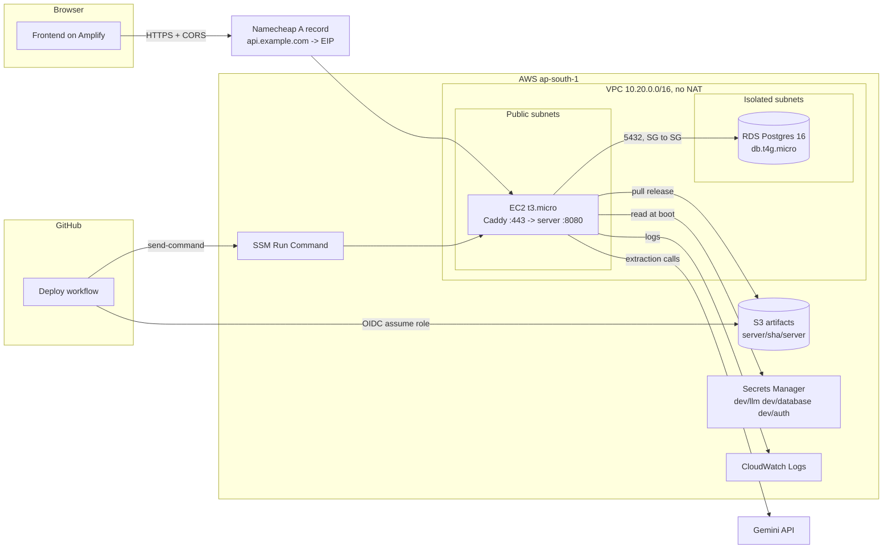

# Deployment architecture: crewreg backend on AWS

As built on 2026-09-06 from `docs/deployment-plan.md`. This document describes
what `npx cdk deploy --all` creates for one environment and how a release
travels from a git commit to a running process. Where it disagrees with the
plan, this document is right.

One deliberate deviation from the plan, from code review: the deploy step no
longer sends the generic `AWS-RunShellScript` document. Each environment gets
its own SSM document (`crewreg-<env>-deploy`) whose content is fixed to the
deploy script and whose only parameter is a git sha, and the GitHub deploy role
may send that document and no other. With the generic document, anyone holding
the role could have run any command as root on an instance that can read every
secret.

## Picture



## Stacks

Three CloudFormation stacks per account, two of them per environment. The
environment name (`dev`) is a CDK context value and appears in every resource
name, tag and secret name.

| Stack | Holds | Why separate |
|---|---|---|
| `crewreg-github-oidc` | The `token.actions.githubusercontent.com` OIDC provider | One per account; a second environment reuses it |
| `crewreg-dev-data` | VPC, database security group, RDS instance, the three secrets | Stateful. Nothing here is replaced casually; `prod` gets termination protection |
| `crewreg-dev-app` | API security group, instance role, instance, Elastic IP, artifacts bucket, log groups, the `crewreg-dev-deploy` SSM document, GitHub deploy role, budget | Stateless. The instance is replaced whenever its bootstrap changes |

The app stack imports the VPC, the database security group id and the three
secret ARNs from the data stack through CloudFormation exports (reference
strength pinned to `strong` in `cdk.json`).

## Network

- VPC `10.20.0.0/16`, two availability zones (an RDS subnet group needs two
  even for Single-AZ).
- Two public `/24` subnets with an internet gateway. The instance lives here
  with a public address so it can reach Secrets Manager, S3, SSM, GitHub
  (Caddy download), Let's Encrypt and the LLM provider directly. No NAT gateway
  exists; that alone would cost more than the rest of the compute.
- Two isolated `/24` subnets with no route to the internet. RDS lives here.
- The VPC's default security group is stripped of all rules by CDK's custom
  resource.

Security groups:

| Group | Inbound | Outbound |
|---|---|---|
| API instance | 80/tcp and 443/tcp from `0.0.0.0/0` | everything |
| Database | 5432/tcp from the API instance group only | none |

Port 8080 is never opened. The binary binds it; only Caddy on the same host
talks to it. There is no SSH rule and no key pair; access is SSM Session
Manager through the instance role.

## Compute

One `t3.micro` (2 vCPU, 1 GiB), Amazon Linux 2023 x86_64. The AMI is looked up
once and cached in `cdk.context.json`; `amiId` in context pins it instead. A
Graviton instance type (`t4g.*`) switches the lookup to arm64 and the Caddy
download to the arm64 build; the backend binary would then need `GOARCH=arm64`.

Instance settings that matter:

- IMDSv2 required.
- CPU credits `standard`, so a busy month slows the instance rather than
  billing surplus credits.
- 10 GiB gp3 encrypted root volume, deleted with the instance.
- No detailed monitoring.
- An Elastic IP, associated in the app stack, so the DNS record survives
  instance replacement.
- Tags `crewreg:env=dev` (from the stack) and `crewreg:role=api` (from the
  instance). The deploy role's SSM permission and the deploy workflow target
  these tags, never an instance id.
- `userDataCausesReplacement`: any change to the rendered first-boot script
  creates a new instance and terminates the old one.

### What cloud-init does on first boot

`lib/user-data.ts` renders `instance/bootstrap.sh` plus a quoted heredoc for
every file below into one script (about 10 KB, hard limit 16 KB), logged to
`/var/log/crewreg-bootstrap.log`.

| Path on the box | Source | Purpose |
|---|---|---|
| `/etc/crewreg/config.yaml` | rendered | `environment`, `region`, `extract`, `cors`. No secrets; the loader replaces `llm`, `database`, `auth` from Secrets Manager |
| `/etc/crewreg/deploy.env` | rendered | `ARTIFACTS_BUCKET`, `AWS_DEFAULT_REGION` for the deploy script |
| `/etc/crewreg/cloudwatch-agent.json` | `instance/cloudwatch-agent.json` | ships the two log files |
| `/etc/systemd/system/crewreg.service` | `instance/crewreg.service` | the API, as user `crewreg`, `CONFIG_PATH` set, hardened, logs to a file |
| `/etc/systemd/system/caddy.service` | `instance/caddy.service` | Caddy as user `caddy` with `CAP_NET_BIND_SERVICE` |
| `/etc/caddy/Caddyfile` | `instance/Caddyfile` | TLS for `apiHost`, proxy to `127.0.0.1:8080`, 16 MB body cap, JSON access log |
| `/etc/logrotate.d/crewreg` | `instance/logrotate-crewreg` | daily rotation of the service log |
| `/usr/local/bin/crewreg-deploy` | `instance/crewreg-deploy.sh` | installs one release, see below |

Then, in order: `dnf install poppler-utils amazon-cloudwatch-agent
dnf-automatic`; a 2 GiB swap file; security-only automatic updates; the
`crewreg` system user and `/opt/crewreg`; Caddy from its GitHub release
(version pinned in `lib/app-stack.ts`, checksum verified); the CloudWatch
agent; `systemctl enable --now caddy`, `systemctl enable crewreg`; finally,
if `server/current` exists in the bucket, `crewreg-deploy` installs that
release. On a brand-new environment it does not exist yet, the service stays
stopped, and Caddy answers 502 until the first deploy.

### Runtime layout

```
/opt/crewreg/releases/<git-sha>/server     one directory per release, last 5 kept
/opt/crewreg/current -> releases/<git-sha> the symlink systemd runs
/etc/crewreg/config.yaml                   root:crewreg 0640
/var/log/crewreg/server.log                stdout+stderr of the binary
/var/log/caddy/access.log                  Caddy, JSON, rolled at 10 MiB
```

The service unit runs with `NoNewPrivileges`, `PrivateTmp`,
`ProtectSystem=strict` (only `/var/log/crewreg` writable), `ProtectHome`, and
restarts on failure after 3 s. Multipart uploads and `pdftoppm` output go to
the private `/tmp`.

## Database

RDS PostgreSQL 16 on `db.t4g.micro`, Single-AZ, 20 GiB gp3, storage
encrypted, not publicly accessible, in the isolated subnets. Automated backups
are kept 7 days (inside the free backup allowance). Minor versions upgrade
automatically. Deleting the stack takes a final snapshot; deletion protection
is on for `prod` only. Database `crewreg`, role `crew`, port 5432, matching the
local docker-compose so nothing differs between laptop and cloud.

TLS: the backend sets `sslmode=require` for every non-local environment, and
the secret says so explicitly.

Migrations: the backend applies its embedded goose migrations at boot for
every environment except `prod`. There is no separate runner yet, which is
one reason this is `dev`.

## Secrets

Three Secrets Manager secrets, named exactly as the backend's config loader
expects (`<environment>/<section>`, ADR 0015). Their JSON keys are the json
tags of the backend's config structs.

| Secret | Keys | Origin of each value |
|---|---|---|
| `dev/database` | `host`, `port`, `user`, `password`, `dbname`, `sslmode` (+ `engine`, `dbInstanceIdentifier`, ignored) | `password` generated (32 alphanumerics, no punctuation because the backend builds an unquoted DSN); `user`, `dbname`, `sslmode` fixed; `host`, `port` attached by RDS after creation |
| `dev/auth` | `signing_key` | generated, 64 alphanumerics (backend minimum 32 bytes) |
| `dev/llm` | `provider`, `text_model`, `vision_model`, `max_tokens`, `api_key` | first four from `cdk.json`; `api_key` generated as a placeholder and replaced once by `scripts/set-llm-key.sh` |

Only the instance role can read them. No rotation is configured: the backend
reads secrets once at boot, the LLM key belongs to a third party, and rotating
the signing key logs every user out by design (ADR 0021).

After the key is set, models are edited in the secret, not in `cdk.json`. A
changed template regenerates the whole secret.

## Releases and deploys

The artifacts bucket is private, TLS-only, versioned (old versions expire after
30 days) and retained on stack deletion. Layout:

```
server/<git-sha>/server          static linux/amd64 binary
server/<git-sha>/server.sha256   "<hash>  server", checked with sha256sum -c
server/current                   the sha a fresh instance installs at boot
```

A deploy, whether from the backend repo's `Deploy` workflow or
`scripts/deploy.sh`:

1. builds `CGO_ENABLED=0 GOOS=linux GOARCH=amd64 go build -trimpath -ldflags "-s -w"`;
2. uploads the two files and rewrites `server/current`;
3. `aws ssm send-command` with the environment's own document
   `crewreg-dev-deploy` (parameter `Sha=<sha>`) targeting
   `tag:crewreg:env=dev` and `tag:crewreg:role=api`. The document's content is
   fixed by the app stack to `/usr/local/bin/crewreg-deploy {{ Sha }}` and its
   only parameter must match `^[0-9a-f]{7,40}$`, so holding the deploy role
   does not mean being able to run arbitrary commands as root;
4. polls the invocation until it finishes; zero invocations is a failure (no
   instance matched);
5. `curl https://<apiHost>/ping`.

On the instance, `crewreg-deploy` downloads the release, verifies the
checksum, flips `/opt/crewreg/current`, restarts the unit, and waits up to
60 s for `127.0.0.1:8080/ping`. If that never answers it prints the last 50
log lines, flips the symlink back to the previous release, restarts, deletes
the failed release directory, and exits non-zero, which fails the workflow.
The last five releases stay on disk. At first boot the same script runs for
`server/current`; a failure there is logged and left for a re-run over SSM
rather than failing the bootstrap, since everything else on the box is
already in place.

## Identity and access

| Principal | May |
|---|---|
| Instance role `crewreg-dev-api-instance` | `AmazonSSMManagedInstanceCore`; `GetSecretValue`/`DescribeSecret` on the three secrets; `GetObject`/`ListBucket` under `server/*` of the artifacts bucket; write to the two log groups; `logs:DescribeLogGroups` |
| GitHub deploy role `crewreg-dev-github-deploy` | Assumed via OIDC only by jobs of `mattkhoo-wg/shipping-backend` that declare `environment: dev` (`sub` claim `repo:<repo>:environment:dev`, `aud` `sts.amazonaws.com`); `PutObject`/`AbortMultipartUpload` under `server/*`; `ssm:SendCommand` with the `crewreg-dev-deploy` document only, on instances tagged `crewreg:env=dev` only; read command results. Session limit 1 h |

Neither role can read the other's side: the instance cannot publish releases
and the workflow cannot read secrets or open a shell.

## Edge

Caddy holds the certificate for `apiHost` from Let's Encrypt, renews it, and
redirects 80 to 443. The DNS `A` record lives in Namecheap and is created by
hand from the `ElasticIp` output. Caddy adds `Strict-Transport-Security`,
removes the `Server` header, compresses responses, and caps request bodies at
16 MB, just above the backend's own 15 MiB upload limit so the backend is the
one that answers 413.

CORS is not Caddy's job: the backend's own middleware answers preflights from
the origins listed in `config.yaml` (ADR 0022 in the backend repo).

## Observability

- CloudWatch Logs `/crewreg/dev/server` and `/crewreg/dev/caddy`, 14-day
  retention, one stream per instance id. Within the always-free 5 GB/month.
- Default 5-minute EC2 and RDS metrics.
- AWS Budget `crewreg-dev-monthly`: email at 80% of the limit (actual) and at
  100% (forecast). Account-wide, not per stack.
- No alarms, no uptime check. `GET /ping` is the liveness probe if one is
  added later.

## Cost

See the itemised table in `docs/deployment-plan.md`: about $32/month at
on-demand prices, about $1.20/month inside the legacy 12-month free tier, and
covered by credits for some months on an account opened after July 2025.
The only cost lines the design cannot avoid on a paid account are the RDS
instance and the public IPv4 address.

## Known gaps, on purpose

- Single instance, single AZ, no health-based replacement. An instance failure
  is a manual `cdk deploy crewreg-dev-app`.
- `POST /orgs` is unauthenticated and login has no rate limit; these are
  backend items recorded in its `docs/STATUS.md`. The backend must not hold
  real seafarer data yet.
- `prod` needs a migration runner in the backend before it can exist.
- No WAF, no VPC flow logs, no secret rotation, no alarms.
- Caddy and the CloudWatch agent are installed from the internet at first
  boot; an outage of GitHub or the AL2023 mirrors delays a replacement
  instance rather than a running one.
